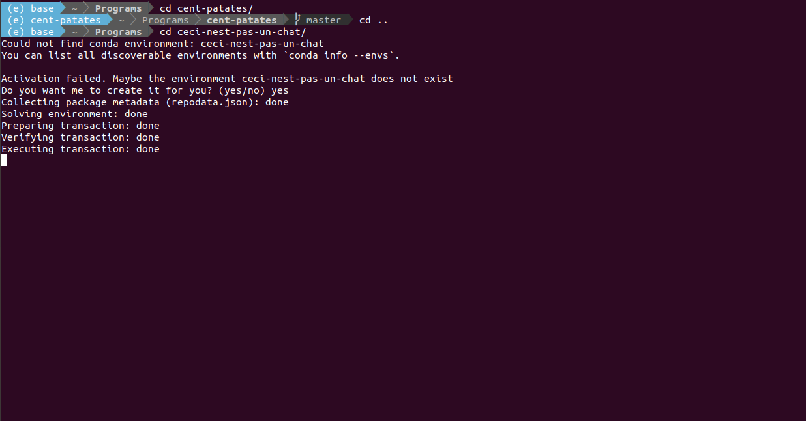

# Conda utils
Some CLI utils to make the life of using conda easier

For the moment, only one is available, but others may appear in the future :)

## Install

1. Clone this repo
2. Add the following lines to your `~/.bashrc` (or equivalent):

    ```sh
    . <PATH-TO-THIS-REPO>/conda-utils.sh
    PROMPT_COMMAND="activate_current_conda -q; $PROMPT_COMMAND"
    ```

    Remember to replace `<PATH-TO-THIS-REPO>` with the path to this repo

## Features

* `activate_current_conda`: Activate the correct environment automatically: add a prompt hook that will look for the `environment.yml` file to use and `conda activate` to it. If the target environment is not installed, will nicely prompt to do so (and remember your choice not to if that's the case). You can also run it manually instead.


